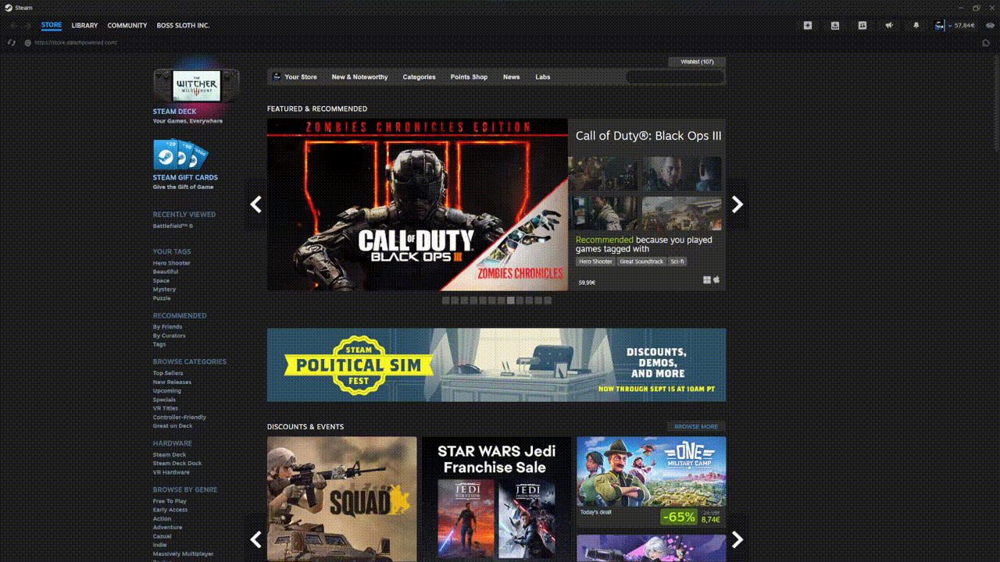
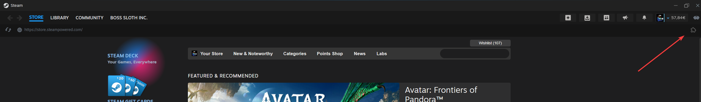
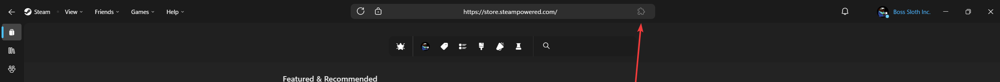

# Extendium

A Millennium plugin that adds chrome extensions support to the steam client
> [!IMPORTANT]
> Extendium is under active development. Some extensions and APIs may not behave exactly like Chrome yet.
> Check the compatibility list and open an issue if you run into problems or missing features.

## Compatibility
Want to know if your favorite chrome extension is compatible with Extendium? Check [here](https://docs.google.com/spreadsheets/d/e/2PACX-1vRDoTrxtBhLurvlxZNW7vYpUtp-dU4iyRgS3GnVKjXx2seONwU_BtORtDoE8WbbrRp0-OohYI2NAM-j/pubhtml) on the compatibility list

## Features
- Install Chrome extensions directly from a Chrome Web Store URL via the Extensions Manager.
- Extensions Manager with actions:
  - Install extension, Manage storage, Browse local files, Settings.
- Extensions toolbar and menu:
  - Puzzle icon next to the address bar opens the Extensions menu.
  - Pin/unpin extensions to the toolbar; right-click extensions for extra options.
- Extension updates:
  - Visual update indicator and Update action; prompts to restart after updating.
- Open the steam web header by holding `ctrl` and clicking `Show Header` in the top right.

## Installation
1. Ensure you have Millennium installed on your Steam client
2. Download the [latest release](https://github.com/BossSloth/Extendium/releases/latest) of this plugin from GitHub or from the [Steambrew](https://steambrew.app/plugins) website
3. Place the plugin files in your Millennium plugins directory (should be a plugins folder in your Steam client directory)
4. Restart your Steam client
5. Enable the Extendium plugin in the Millennium plugin menu
6. Save changes at the top of the Millennium plugin menu and restart Steam

## Usage

Follow these steps to install and manage Chrome extensions inside the Steam client using Extendium.
Or follow this gif.

#### __Open the Extensions menu__
  - Look to the right of the address bar and click the puzzle icon to open the menu.

    
    Or if you are using the Fluenty skin
    

    > [!NOTE]
    If you can't find the puzzle icon, you can open the extension manager by running <a href="steam://extendium/manager">steam://extendium/manager</a>
    If you still can't find it try using the default skin or adjusting the margins in the settings menu

  - In the menu, click __Manage extensions__ to open the Extensions Manager.

#### __Installing an extension from the Chrome Web Store__
  - In the Extensions Manager, click the __Install extension__ button.
  - Paste the Chrome Web Store URL of the extension into the input field.
    Example: `https://chromewebstore.google.com/detail/steamdb/kdbmhfkmnlmbkgbabkdealhhbfhlmmon`
  - Click __Install__. You will see "Installing..." while the download completes.
  - When prompted, click __Restart Now__ so Steam reloads and the extension becomes active.

#### __Where extensions appear__
  - After restarting, extensions will show up in the extensions bar next to the address bar. Their action can be opened by left-clicking on them, or you access extra options by right-clicking on them.
  - You can click the puzzle icon again to open the __Extensions__ menu to pin/unpin extensions from the bar and to manage the extension

#### __Manage installed extensions__
  - In the Extensions Manager, each extension card provides actions:
    - __Details__: View the extension’s name, version, description, and any errors.
    - __Update__: If an update is available a green update button will appear, click the update pill/badge to download it. You will be prompted to restart afterwards.
    - __Remove__: Uninstall the extension. You will be prompted to restart afterwards.
  - Top toolbar actions:
    - __Manage storage__: Inspect and manage storage used by extensions use this if some extension setting is not working and needs to be reset.
    - __Browse local files__: Opens the directory where the extensions are stored.
  - Note: Enabling/disabling via a toggle is not available yet.

#### __Troubleshooting__
  - If installation fails, check the logs and try again and check if you can access the Chrome web store. If it still fails make a bug report.
  - If you don’t see the puzzle icon, ensure Extendium is enabled in Millennium and that you clicked __Save changes__ at the top of the Millennium plugin menu.
  - Check the [compatibility list](https://docs.google.com/spreadsheets/d/e/2PACX-1vRDoTrxtBhLurvlxZNW7vYpUtp-dU4iyRgS3GnVKjXx2seONwU_BtORtDoE8WbbrRp0-OohYI2NAM-j/pubhtml) to verify whether a specific extension is known to work or not.

## Known extension features that are currently not supported
- context menus
- alarms
- notifications
- permission control
- global keyboard shortcuts
- anything to do with tabs

## Backend services
Extendium includes optional backend helpers that are started automatically by Millennium when the plugin loads (see `backend/main.py`):
- __WebSocket server__ on port `8791` (initialize and run via `backend/websocket/`).
- __CORS proxy__ on port `8792` (see `backend/cors_proxy.py`).

## Contributing
Contributions are welcome! Please feel free to submit a Pull Request.

### Development setup
> It is recommended to put the plugin repository in your Steam plugins folder or make some symbolic links to the
> repository for easier development.

1. Clone the repository using `git clone https://github.com/BossSloth/Extendium.git`
2. Run `bun install` (bun is recommended; other package managers may work, but bun is preferred).
3. Use one of the following workflows:
   - Development: `bun dev` (fast rebuilds; use `F5` in the Steam client to reload the UI)
   - Watch mode: `bun watch` (watches `webkit`, `shared`, `frontend`, and `public/extendium.scss`, then runs Sass and dev)
   - Release build: `bun build`
4. Then press `F5` in the Steam client to reload the UI.

> For changes to the `backend/`, fully restart the Steam client.

### Scripts
- `bun dev` — Runs the Millennium toolchain in dev mode (`millennium-ttc --build dev --no-update`).
- `bun watch` — Watches source folders and Sass, runs the Sass compiler, then starts dev mode.
- `bun build` — Builds release assets (`sass` then `millennium-ttc --build prod`).

### Project structure
- `frontend/` — UI, extension manager, toolbar button, URL handling, and main window patches. Pretty much everything to do with the Steam UI
- `shared/` — Shared TypeScript utilities and types used across the plugin (e.g., Chrome API shims).
- `webkit/` — WebKit-specific logic and request handling for the Steam client. This is loaded in on web pages.
- `public/` — Static assets and styles. `extendium.scss` compiles to `extendium.css`.
- `backend/` — Backend helpers (e.g., WebSocket server, CORS proxy) for advanced features.
- `.millennium/Dist/` — Build output generated by the Millennium toolchain.

## License
This project is licensed under the MIT License - see the [LICENSE](LICENSE) file for details.
