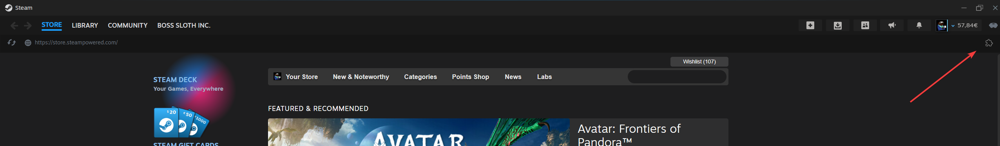
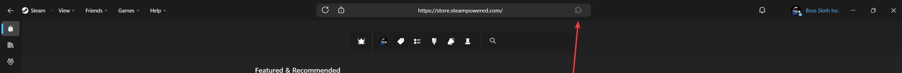

# Extendium

A Millennium plugin that brings the power of Chrome extensions to your Steam client.

> [!IMPORTANT]
> While many extensions work, some APIs may not behave exactly like they do in Chrome. Please check the compatibility list and open an issue if you encounter problems or missing features.

## Compatibility

Wondering if your favorite Chrome extension works with Extendium? Check our official **[Compatibility List](https://docs.google.com/spreadsheets/d/e/2PACX-1vSGe55SdLrz9vILg6jPDvlOrkpeOgInPxor96t5MreHPkXNhft4XSwetj70aYhNjCocnfLxpk29Nkkf/pubhtml)**.

## Features

- **Install from Chrome Web Store**: Seamlessly install extensions directly from a web store URL.
- **Extensions Manager**: A central hub to manage your extensions with actions like Install, Browse Local Files, and configure Settings.
- **Toolbar and Menu**: Access your extensions via the puzzle icon next to the address bar. Pin your favorites to the toolbar or right-click for more options.
- **Steam Web Header**: Hold `Ctrl` and click `Show Header` in the top right to reveal the Steam web header for advanced usage.

## Installation

1. Ensure you have **Millennium** installed on your Steam client.
2. Download the **[latest release](https://github.com/BossSloth/Extendium/releases/latest)** from GitHub or install it from the **[Steambrew](https://steambrew.app/plugin?id=788ed8554492)** website.
3. (Manual only) Place the plugin files into your Millennium plugins directory (typically a `plugins` folder inside your Steam installation).
4. **Restart** your Steam client.
5. Open the Millennium plugin menu and **enable** the Extendium plugin.
6. Click **Save Changes** at the top of the menu and **restart Steam** one more time.

## Usage

Here's how to get started with installing and managing extensions in Steam.

### 1. Open the Extensions Menu

- Click the **puzzle icon** to the right of the address bar to open the extensions menu.

*Default Skin:*

*Fluenty Skin:*

> [!NOTE]
> Can't find the puzzle icon? You can launch the manager directly by typing `steam://extendium/manager` in your browser or running it with `Win + R`. If it's still missing, try switching to the default Steam skin or adjusting the margins in the settings.

- From the menu, click **Manage extensions** to open the Extensions Manager.

### 2. Installing extensions

1. In the Extensions Manager, click the **Install extension** button.
2. This will open the Chrome Web Store. Here you can install any extension just like how you would in a regular browser.

> [!NOTE]
> All extensions you install this way WILL stay installed even after disabling or removing Extendium as they are installed into your steam. Remember to uninstall them via Extendium if you no longer want to use them.

### 3. Access and Manage Your Extensions

- **Extension Toolbar**: After installing an extension, it will appear in the extensions menu where you can pin it to the toolbar. Left-click an icon to open its action, or right-click for more options.

- **Management Actions**: In the Extensions Manager, each extension has a card with the following actions:
  - **Details**: View the extension's name, version, description, and error logs.
  - **Remove**: Uninstall the extension. (This only works if an chromium page isn't currently open)
  - **Enable/Disable**: Toggle the extension on or off without uninstalling it.

### 4. Configure External Links

By default, all links open inside the Steam client. You can force certain URLs to open in your default web browser.

1. Go to **Extensions Manager** > **Settings** (cog icon).
2. In the **External Links** section, add a URL pattern to open externally (e.g., `youtube.com`).
3. You can use simple text or check the **Regex** box for advanced matching.

## Troubleshooting

- **Installation Fails**: Check the logs in the Extension Manager, verify your internet connection, and ensure you can access the Chrome Web Store. If it persists, please file a bug report.
- **Puzzle Icon is Missing**: Ensure Extendium is enabled in the Millennium menu and that you clicked **Save Changes** and restarted. Skin compatibility issues can also hide the icon.
- **Extension Not Working**: Check the **[Compatibility List](https://docs.google.com/spreadsheets/d/e/2PACX-1vSGe55SdLrz9vILg6jPDvlOrkpeOgInPxor96t5MreHPkXNhft4XSwetj70aYhNjCocnfLxpk29Nkkf/pubhtml)** first. If it's listed as compatible, try reinstalling it. If the issue continues, open an **Extension Issue** on GitHub.

### Manual Extension Installation

If you wish to install an extension manually for example, if you cannot access the Chrome Web Store or want to install a development version, follow these steps as it's the same as doing it in a normal chrome browser.

1. **Download the Extension Files**
   - Download the extension as a `.crx` file, `.zip` archive containing the extension files, or have the extension folder on your disk.

2. **Open Chrome Extensions Page**
   - In the extension manager, click the `Advanced extension management` button. This will open the `chrome://extensions` page in the Steam browser.

3. **Enable Developer Mode**
   - Toggle on **Developer mode** in the top right corner of the extensions page.

4. **Load the Extension**
   - Click **Load unpacked** and select the folder containing your extension files.
   - Alternatively, you can drag and drop a `.crx` file directly onto the extensions page.

5. **Verify Installation**
   - The extension should now appear in your extensions list and be ready to use.

## Known Limitations

Extendium is still in development, and some Chrome extension features are not yet supported:

- Tab-related APIs (`chrome.tabs`) - This is the most impactful limitation as many extensions rely on tab management for applying features to the current page.
- Context Menus in the steam client (In the chromium browser they work fine)

## Security & Privacy

> [!WARNING]
> Extendium runs Chrome extensions within the Steam client environment. Please consider the following:

- **Extension Permissions**: Extensions request permissions just like in regular Chrome. Review these carefully before installation.
- **Data Access**: Extensions can access web content loaded in Steam's browser, including Steam store pages.
- **Network Requests**: Extensions can make network requests that may expose your Steam session data.
- **Recommendation**: Only install extensions from trusted sources and review their code when possible.

## Reporting Issues

Encountered a bug or have a feature request? Please **[open an issue on GitHub](https://github.com/BossSloth/Extendium/issues/new/choose)**. Using the correct template helps us resolve problems faster.

- **Bug Report**: Use this if you've found a problem with Extendium itself, such as a UI glitch, a problem with the extension manager, or a backend error. This is for bugs that are not specific to a single Chrome extension.

- **Extension Issue**: If a specific Chrome extension isn't working as expected (e.g., it won't install, its features are broken, or it's causing errors), please use this template.

- **Extension Request**: Use this template for two main purposes:
  1. To request support for a Chrome extension that is not yet compatible with Extendium.
  2. To report that an extension works correctly but is not yet on the [compatibility list](https://docs.google.com/spreadsheets/d/e/2PACX-1vSGe55SdLrz9vILg6jPDvlOrkpeOgInPxor96t5MreHPkXNhft4XSwetj70aYhNjCocnfLxpk29Nkkf/pubhtml). Your contributions help us keep the list up-to-date for everyone!

## Contributing

Contributions are welcome! Feel free to submit a pull request or open an issue to discuss your ideas.

### Development Setup

> **Tip**: For easier development, place the plugin repository directly in your Steam plugins folder or use a symbolic link.

1. Clone the repository: `git clone https://github.com/BossSloth/Extendium.git`
2. Install dependencies: `bun install`
3. Start the development server: `bun dev`
4. Reload the UI in Steam by pressing `F5` while in `-dev` mode.

> For changes to the `backend/`, a full restart of the Steam client is required.

### Build Scripts

- `bun dev`: Runs the Millennium toolchain in dev mode for fast rebuilds.
- `bun watch`: Watches all source folders and automatically rebuilds on changes.
- `bun build`: Creates a production-ready build.

### Project Structure

- `frontend/` - UI, extension manager, toolbar button, URL handling, and main window patches. Pretty much everything to do with the Steam UI
- `shared/` - Shared TypeScript utilities and types used across the plugin (e.g., Chrome API shims).
- `webkit/` - WebKit-specific logic and request handling for the Steam client. This is loaded in on web pages.
- `public/` - Static assets and styles. `extendium.scss` compiles to `extendium.css`.
- `backend/` - Backend
- `.millennium/Dist/` - Build output generated by the Millennium toolchain.

## License

This project is licensed under the MIT License - see the [LICENSE](LICENSE) file for details.
